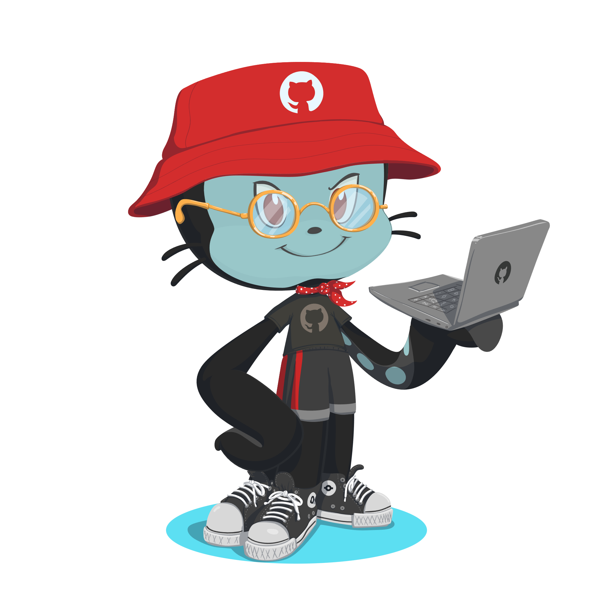

<h1 align="center">Hi I'm AmirMohammad Khaksar</h1>

  Full-Stack Developer • Clean Code Enthusiast • Problem Solver

  

## 🧩 Tech Stack

### 🎨 Frontend

  
  
   
   
  
  
    
  
  
  
  

### ⚙️ Backend

  
  
  
  

### 🛠 Tools

  
  

## 📬 Contact

  
  

  <b>“Building with clarity, precision, and purpose.”</b>

